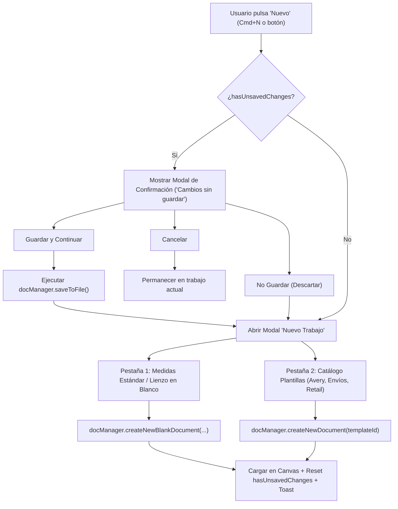

# Plan de Implementación: Flujo de "Nuevo Trabajo", Verificación de Cambios y Catálogo de Plantillas / Medidas Estándar

**Fecha y Hora:** 2026-09-24 09:42

Este plan describe la arquitectura y la interfaz para el flujo del botón **Nuevo** en **LabelLove**: detección de cambios sin guardar, diálogo de decisión (Guardar / No guardar / Cancelar), y modal interactivo para crear un trabajo en blanco con medidas estándar o seleccionar plantillas del catálogo (incluyendo la línea Avery® y formatos industriales populares).

---

## 1. Requerimientos del Usuario

1. **Detección de Cambios sin Guardar**: Al presionar "Nuevo" (botón en la barra superior o atajo `Cmd+N` / `Ctrl+N`), verificar si el documento actual tiene modificaciones no guardadas (`hasUnsavedChanges`).
2. **Diálogo de Confirmación Decisoria**:
   - Si existen cambios: preguntar al usuario si desea guardar los cambios.
   - **Guardar y continuar**: Guarda el archivo actual (mediante el motor de guardado de LabelLove) y procede a la creación del nuevo trabajo.
   - **No guardar (descartar)**: Descarta los cambios no guardados y procede a la creación del nuevo trabajo.
   - **Cancelar**: Cierra el diálogo y se mantiene en el documento actual sin perder nada.
3. **Modal de Nuevo Trabajo (`newJobModal`)**:
   - Una vez superada la confirmación (o si no había cambios pendientes):
     - **Opción A (Lienzo en Blanco / Medidas Estándar)**:
       - Selector rápido de medidas estándar populares (Rollo 4x6" paquetería, 4x3", 50x30 mm retail, 50x50 mm cuadrado, 32x19 mm joyería, pliegos Carta/A4).
       - Configuración personalizada (ancho, alto, orientación retrato/paisaje, tipo rollo/pliego, sustrato, resolución 203/300/600 DPI, nombre).
       - Widget de previsualización visual proporcional en tiempo real.
     - **Opción B (Catálogo de Plantillas & Avery)**:
       - Filtro por categorías (Todas, Avery® Carta/A4, Envíos & E-Commerce, Retail & Almacén, Especiales/Redondas).
       - Búsqueda en vivo de plantillas.
       - Ampliación del catálogo con formatos Avery populares: Avery 5160 (30 etiquetas), Avery 5163 (10 etiquetas de envío 4x2"), Avery 5164 (6 etiquetas grandes), Avery 22807 (redondas 2"), Avery 5395 (gafetes), además de formatos de rollo para logística y comercio.
       - Tarjetas con miniatura visual gráfica SVG, especificaciones técnicas y botón de uso directo.

---

## 2. Arquitectura de Cambios

---

## 3. Archivos Involucrados y Modificaciones

| Archivo | Acción | Descripción |
|---|---|---|
| [index.html](file:///Users/francisco/Herd/labellove/index.html) | Modificar | Agregar el modal de confirmación de cambios (`unsavedChangesModal`) y el modal extendido de nuevo trabajo (`newJobModal`) con pestañas y previsualizador. |
| [styles/components.css](file:///Users/francisco/Herd/labellove/styles/components.css) | Modificar | Estilos premium para diálogos de alerta, tabs de creación, mini-tarjetas de medidas estándar, previsualizador interactivo y catálogo de plantillas Avery. |
| [js/templates.js](file:///Users/francisco/Herd/labellove/js/templates.js) | Modificar | Extender el catálogo de plantillas con Avery 5163, Avery 5164, Avery 22807, Avery 5395, plantillas de rollo cuadrado y frascos. |
| [js/document-manager.js](file:///Users/francisco/Herd/labellove/js/document-manager.js) | Modificar | Implementar método `createNewBlankDocument(...)`, soporte para guardar y continuar con promesas en `saveToFile()`. |
| [js/app.js](file:///Users/francisco/Herd/labellove/js/app.js) | Modificar | Orquestar el flujo al pulsar Nuevo (botón y `Cmd+N`), lógica de las pestañas del modal, filtros de plantillas, previsualizador interactivo y sincronización de controles. |

---

## 4. Plan de Verificación Paso a Paso

1. **Verificación de Cambios sin Guardar**:
   - Modificar una etiqueta existente (agregar un texto o mover un elemento) -> el badge cambia a *Modificado*.
   - Pulsar "Nuevo" -> Debe aparecer el modal de "¿Deseas guardar los cambios?".
   - Pulsar "Cancelar" -> El diálogo se cierra y el trabajo permanece intacto.
   - Pulsar "Guardar y continuar" -> Llama a guardar archivo y acto seguido despliega el modal de "Nuevo Trabajo".
   - Probar en otro intento con "No guardar" -> Pasa directamente al modal de "Nuevo Trabajo".
2. **Verificación sin Cambios**:
   - Con el documento guardado (*Guardado*), pulsar "Nuevo" -> Abre directamente el modal de "Nuevo Trabajo".
3. **Verificación de Lienzo en Blanco**:
   - Seleccionar un preset de medidas estándar (ej. Rollo 4x6" o Pliego Avery 5160) -> Los campos de ancho/alto se actualizan y el previsualizador muestra la proporción.
   - Modificar manualmente las dimensiones e invertir orientación -> La previsualización responde.
   - Pulsar "Crear Lienzo en Blanco" -> El canvas se vacía, adopta las medidas exactas, se actualiza el inspector, se limpia el indicador de cambios y se muestra toast de confirmación.
4. **Verificación de Catálogo de Plantillas & Avery**:
   - Cambiar a la pestaña "Plantillas Populares & Avery".
   - Filtrar por "Avery" y buscar por texto -> Se filtran las tarjetas en vivo.
   - Seleccionar una plantilla (ej. Avery 5163 o Avery 22807) -> Se carga el diseño prediseñado con sus elementos, dimensiones y configuración de pliego correspondiente.
