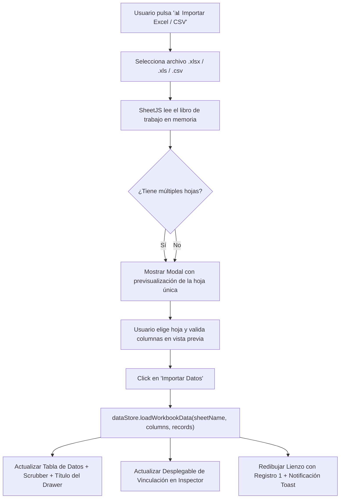

# Plan de Implementación: Importador de Datos Excel (.xlsx / .xls / .csv) Multi-Hojas

**Fecha y Hora:** 2026-09-24 10:24

Este plan detalla la arquitectura, componentes de interfaz y lógica para permitir la **importación de libros de Excel (`.xlsx`, `.xls`) y archivos `.csv` con soporte multi-hoja** en **LabelLove**, facilitando la selección de hojas de cálculo, previsualización de datos y sincronización reactiva inmediata con el lienzo y el inspector de variables.

---

## 1. Requerimientos del Usuario

1. **Importación desde la UI**:
   - Botón visible e intuitivo en el Data Drawer inferior para cargar archivos Excel (`.xlsx`, `.xls`) o `.csv`.
2. **Soporte Multi-Hojas**:
   - Cuando un libro de Excel contiene más de una pestaña u hoja, la UI debe permitir seleccionar de forma clara cuál hoja importar.
3. **Previsualización y Detección de Columnas**:
   - Detección automática de encabezados en la primera fila para convertirlos en variables `{{ nombre_columna }}`.
   - Previsualización rápida de las primeras filas y conteo total de registros.
4. **Selector Dinámico de Hojas en el Data Drawer**:
   - Si se carga un archivo con múltiples hojas, mantener el selector de hojas visible en el encabezado del Data Drawer para permitir alternar entre hojas en cualquier momento sin tener que volver a subir el archivo.
5. **Sincronización Reactiva**:
   - Al cargar o cambiar de hoja, el `DataStore` debe notificar a todos los suscriptores:
     - El lienzo actualiza los textos, códigos de barras y QR vinculados.
     - El inspector lateral actualiza las opciones del menú *"Vincular a columna de datos"*.
     - La tabla interactiva y el scrubber (`< 1 de N >`) reflejan las nuevas filas.
     - La serialización `.labellove` resguarda las nuevas columnas y datos.

---

## 2. Flujo de Trabajo

---

## 3. Componentes y Archivos Involucrados

| Archivo | Acción | Descripción |
|---|---|---|
| [index.html](file:///Users/francisco/Herd/labellove/index.html) | Modificar | Agregar script CDN de SheetJS (`xlsx.full.min.js`), botón "Importar Excel / CSV" en el Data Drawer, input file oculto, y el modal interactivo `#excelImportModal`. |
| [styles/components.css](file:///Users/francisco/Herd/labellove/styles/components.css) | Modificar | Estilos para el modal de importación de Excel, selector de pestañas/hojas, tabla de previsualización compacta y selector de hoja activa en el Data Drawer. |
| [js/data-store.js](file:///Users/francisco/Herd/labellove/js/data-store.js) | Modificar | Agregar métodos `loadSheet(sheetName, columns, records)` y almacenamiento del libro activo para permitir cambio rápido de hojas. |
| [js/app.js](file:///Users/francisco/Herd/labellove/js/app.js) | Modificar | Integrar lectura de archivos con `FileReader` y SheetJS, lógica del modal `#excelImportModal`, renderizado de vista previa y sincronización con el selector de hojas. |
| `examples/datos_envios_multihoja.xlsx` | Crear | Archivo de muestra Excel multi-hojas con pestañas reales (`Envios_Express`, `Inventario_Retail`, `Gafetes_Eventos`) para pruebas inmediatas. |

---

## 4. Verificación y Pruebas

1. **Prueba de Carga**:
   - Subir un archivo `.xlsx` con varias hojas (ej. `datos_envios_multihoja.xlsx`).
   - Verificar que el modal detecta las pestañas y muestra su conteo de filas y columnas.
2. **Prueba de Cambio de Hoja en Modal**:
   - Cambiar entre hojas y confirmar que la tabla de vista previa se actualiza inmediatamente con los encabezados correspondientes.
3. **Prueba de Aplicación a la Etiqueta**:
   - Confirmar importación y verificar que el scrubber muestra el total de registros de la hoja elegida.
   - Vincular un texto o código de barras a una de las nuevas columnas.
   - Navegar con el scrubber para ver cómo cambian los valores en tiempo real.
4. **Prueba de Selector de Hoja en Barra Inferior**:
   - Alternar de hoja directamente desde el Data Drawer sin volver a subir el archivo.
